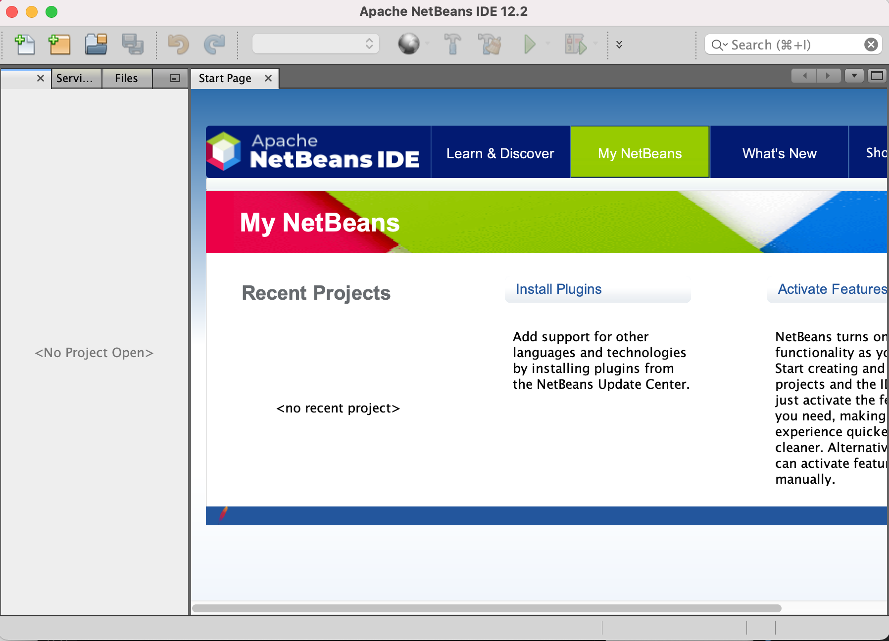
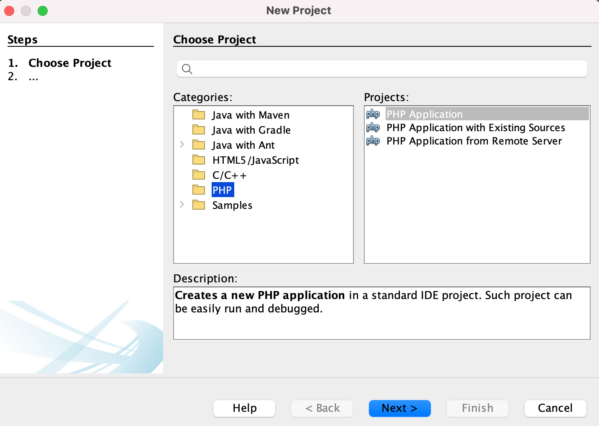
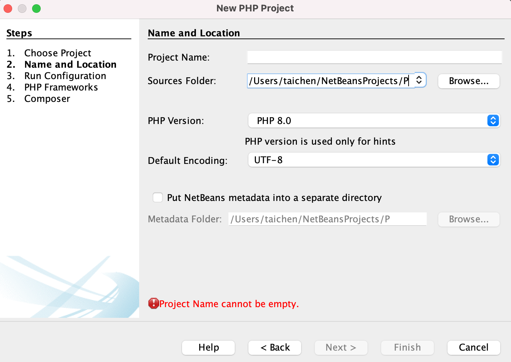
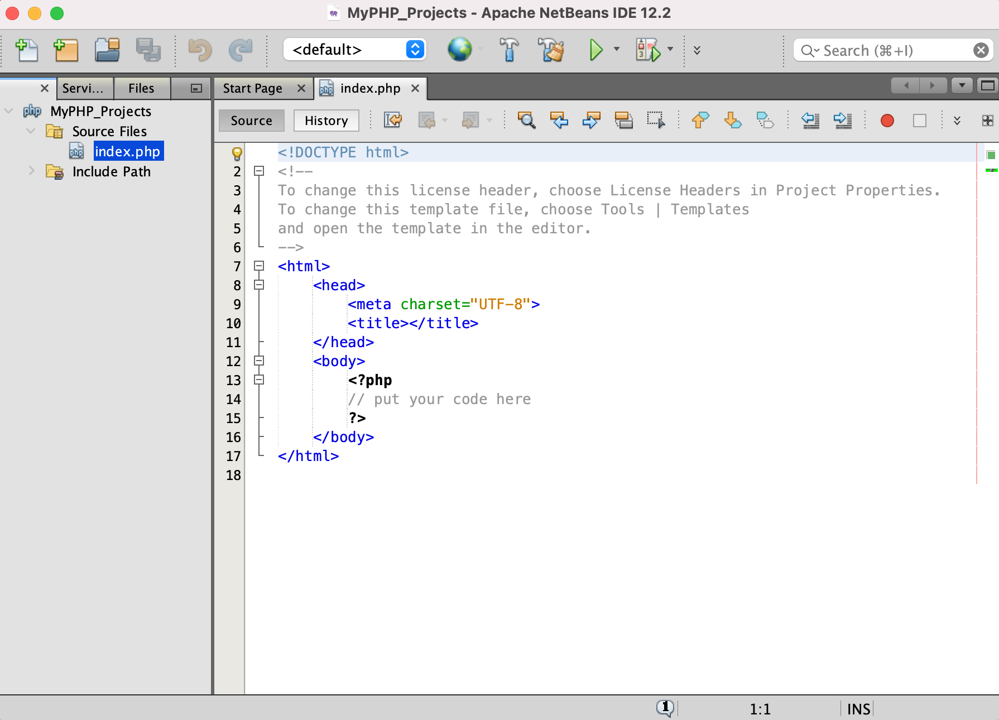
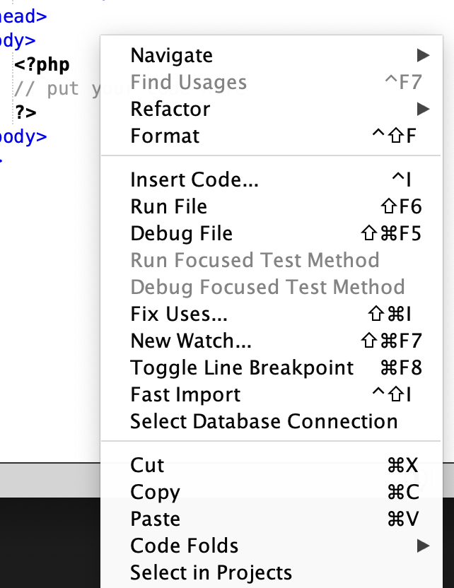

# Getting Started

## Environment Setup

You can use any IDE or text editor of your choice, the easiest one to use would be Netbeans which can be downloaded [here](https://netbeans.apache.org/). Netbeans allows you to immedietly execute your PHP code by right clicking on the .php file and clicking execute file, this is helpful for us since we need a server to host our files.

If you use another IDE, there are different ways to run a development server so you can execute your files. For example, if you use Visual Studio Code, one way to execute your files by using a server would be to use XAMPP.

### Environment Setup With Netbeans (MAC)

Here is Netbeans IDE when I first open it up.

Lets create a project where we can easily add all of our PHP files. On MAC go to **File -> New Project.** 

We will be creating a **PHP Application**, then click **next**.

Go ahead and give your project a name, and you can choose where to save your project. After adding a name, go ahead and click **Finish.** The default configurations on steps 3/4/5 are fine.

You can now see the Netbeans IDE with an index.php file. If you were to right click on the file you will get this popup.

Here you can choose to run the file which will open up a localhost server on your default web browser.